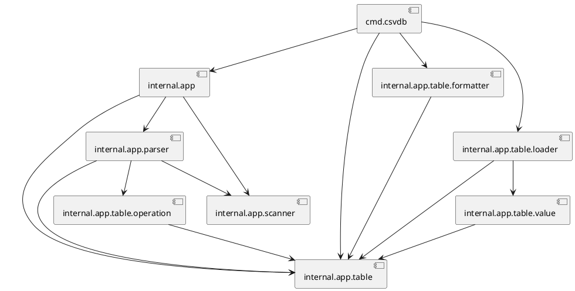

# GoDepUML

Небольшой скрипт для создания простой диаграммы зависимостей на PlantUML.

## Использование

```bash
godepuml -p <path-to-project> -o <output-puml-file> [exlude-1 ... exclud-N]
```

## Пример

Для проекта [csvdb](https://github.com/stepan2volkov/csvdb) будет сгенерирован файл со следующим содержанием:


Для генерации изображения можно установить puml локально, или воспользоваться [сервером](http://www.plantuml.com/plantuml/uml).

